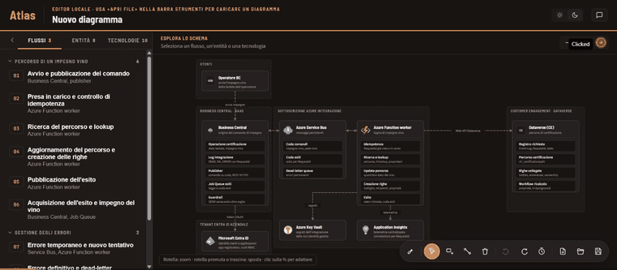
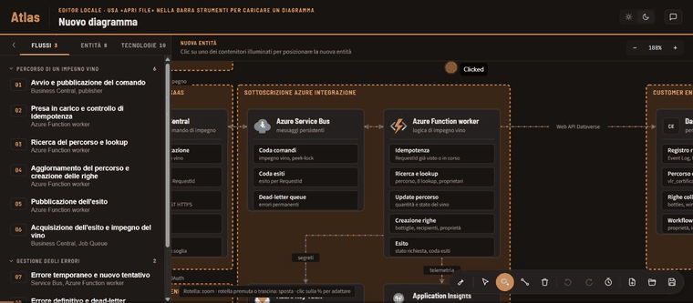
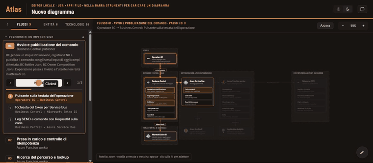
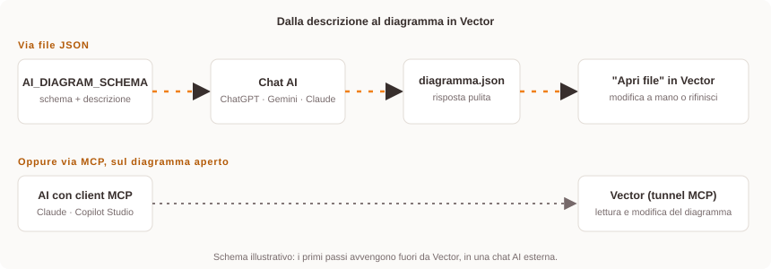

<p align="center">
  
</p>

<h1 align="center">Vector</h1>

<p align="center">
  Portale per gli schemi architetturali e i documenti del Solution Architect, organizzati per progetto.
</p>

Vedi `SPEC.md` per la specifica funzionale e `CLAUDE.md` per le istruzioni di sviluppo.

> **Stato attuale:** Vector è un editor di diagrammi architetturali disponibile come app desktop (Electron) e nel browser.

## Indice

- [Funzionalità](#funzionalità)
- [Generare un diagramma con un'AI](#generare-un-diagramma-con-unai)
- [Stack](#stack)
- [Sviluppo](#sviluppo)
- [App desktop (Electron)](#app-desktop-electron)

## Funzionalità

### Esplorare il diagramma



- **Diagramma interattivo** organizzato in bande (contenitori), entità con icona o monogramma, collegamenti etichettati (anche bidirezionali) e dettagli interni per entità (livello "component").
- Cliccando un'entità o una tecnologia si **evidenziano i collegamenti diretti** e il pannello laterale ne mostra i dettagli.
- **Catalogo icone** con oltre 600 servizi Azure e 300 icone Microsoft 365/Power Platform, più un dialog di selezione a tile per cambiare icona in un clic.
- **Zoom e pan** del canvas, tema chiaro/scuro.
- **Tecnologie trasversali** e matrice di autenticazione (identità gestita, token, secret, permessi delegati) collegate alle entità.

### Modifica manuale



- Aggiungi, sposta ed elimina entità, contenitori e collegamenti direttamente sul disegno; ridimensiona i contenitori e riancora i collegamenti trascinandoli.
- **Annulla/ripeti** e **storico versioni** navigabile, con snapshot di ogni modifica (manuale o generata dalla chat).
- **Apri file / Salva** un diagramma `.json` in locale (File System Access API), con avviso se ci sono modifiche non salvate.

### Riproduzione dei flussi



- I flussi (sequenze di passi tra entità) si **riproducono passo-passo**, con evidenziazione del collegamento, delle entità e degli eventuali dettagli interni coinvolti in ciascun passo.

### Assistente in chat

- Pannello di chat basato su **Claude (Anthropic)** con *tool calling*: l'assistente usa esattamente gli stessi comandi dell'editor manuale (`addEntity`, `addEdge`, `addFlow`, `addTechnology`, `updateEntity`, `deleteElement`, ...), quindi annulla/ripeti e storico versioni funzionano allo stesso modo sia che la modifica arrivi dalla UI sia dalla chat.
- Richiede una chiave API Anthropic personale, inserita e salvata localmente dal pannello della chat.

### Assistente esterno via MCP (solo app desktop)

- Il diagramma aperto può essere esposto come **server MCP** (Model Context Protocol), così un'AI esterna compatibile (Claude, Copilot Studio o altri client MCP) può leggerlo e modificarlo con le stesse operazioni dell'editor.
- Dal pannello **MCP** si avvia il server locale (solo `127.0.0.1`), si genera e si rigenera il token di accesso, e si attiva il permesso di modifica (default: sola lettura).
- Il pulsante **Avvia tunnel** espone il server tramite Microsoft Dev Tunnels, con un URL pubblico da dare al client.
- Le modifiche via MCP compaiono nello storico versioni con origine `mcp`, quindi annulla/ripeti funzionano come per le modifiche manuali.
- Strumenti disponibili: lettura (`getDiagram`, `listEntities`, `getEntity`, `listFlows`, `listIcons`) e modifica di contenitori, entità, dettagli interni, collegamenti, flussi e tecnologie, con icone dal catalogo.

Istruzioni complete per l'installazione, il tunnel e la configurazione dei client: [`MCP_SETUP.md`](MCP_SETUP.md).

### App desktop

- Build Electron con installer Windows (NSIS), hot reload in sviluppo.

### In programma

- ADR collegati al diagramma o a singoli elementi.

## Generare un diagramma con un'AI

 AI -> JSON -> Apri file in Vector" width="100%" />

Vector legge un formato JSON documentato riga per riga in [`AI_DIAGRAM_SCHEMA.md`](AI_DIAGRAM_SCHEMA.md). Il flusso consigliato per partire da zero è:

1. **Copia l'intero contenuto** di [`AI_DIAGRAM_SCHEMA.md`](AI_DIAGRAM_SCHEMA.md) in una qualsiasi chat AI (ChatGPT, Gemini, Claude, ecc.).
2. **Nello stesso messaggio**, descrivi in linguaggio naturale l'architettura o il flusso da rappresentare: sistemi coinvolti, come comunicano, eventuali passi di un processo.
3. Chiedi che la risposta sia **solo il JSON**, senza testo intorno e senza blocco di codice markdown.
4. Salva la risposta in un file `.json`.
5. In Vector, apri quel file con **"Apri file"** nella barra degli strumenti dell'editor (icona cartella, in basso a destra). Il diagramma si apre direttamente.
6. **Integra, correggi o estendi** il risultato a mano nell'editor (entità, collegamenti, flussi, icone...), oppure torna dalla stessa AI con il problema riscontrato e chiedi una correzione, poi reimporta.

Il documento dello schema include anche le regole di layout (dimensioni di entità e bande, percorsi dei collegamenti) e un esempio minimo completo da incollare subito per verificare che l'importazione funzioni.

## Stack

- React + TypeScript + Vite (frontend)
- Electron (app desktop) e server MCP locale per l'assistente esterno
- Persistenza su file JSON, non su database relazionale:
  - apri/salva un file locale (File System Access API con fallback a download/upload)
  - storico versioni: incluso nello stesso file JSON come array di snapshot (vedi `src/store/diagramStore.ts`)

## Sviluppo

```bash
npm install
npm run dev
```

## App desktop (Electron)

```bash
npm run dev:electron
```

Avvia il dev server Vite e apre l'app in una finestra Electron, con hot reload.

```bash
npm run build:electron
```

Compila il frontend e genera l'installer Windows (NSIS) in `release/`.

Se cambi il logo in `public/vector-logo.png`, rigenera le icone usate dall'app desktop
(`build/icon.ico` per l'installer, `build/icon.png` per l'icona della finestra) prima di
lanciare `build:electron`:

```bash
node scripts/make-icon.cjs
```
